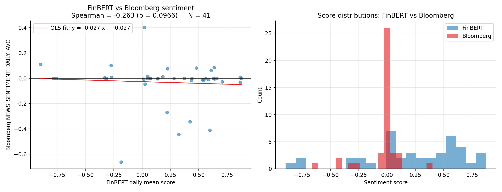
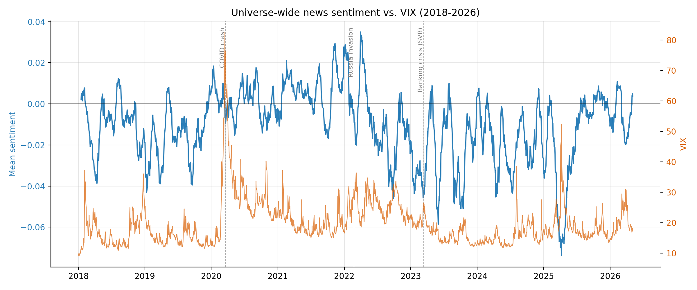
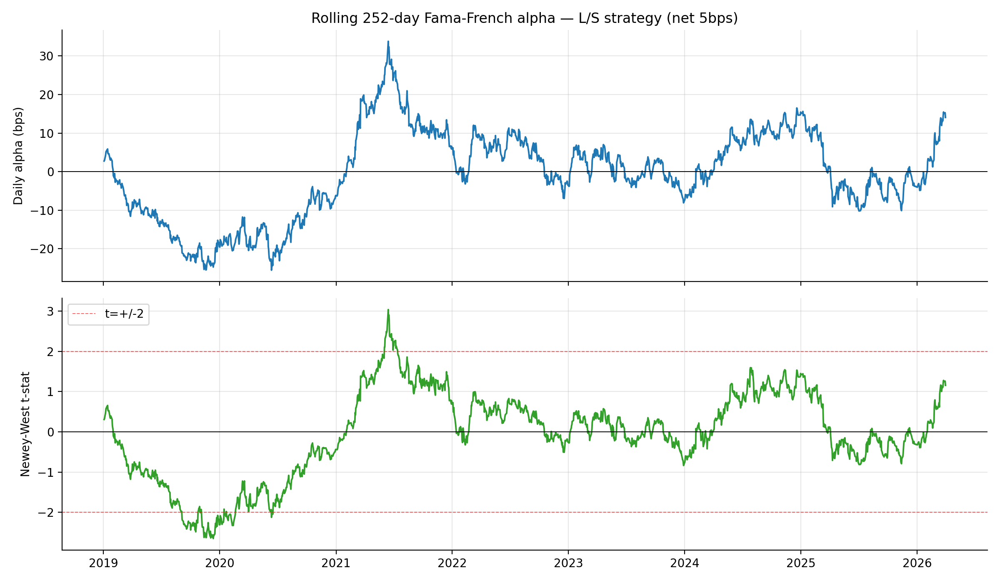

<p align="center">
  <h1 align="center">Bloomberg Sentiment × FinBERT</h1>
  <p align="center">
    <b>An empirical test of whether Bloomberg's proprietary news-sentiment signal can be replicated with open-source FinBERT — and what the gap tells us about quant strategies.</b>
  </p>
  <p align="center">
    <a href="https://github.com/siddhant-rajhans/bloomberg-sentiment-finbert"></a>
    <a href="https://github.com/siddhant-rajhans/bloomberg-sentiment-finbert/blob/main/LICENSE"></a>
    <a href="https://www.python.org/downloads/"></a>
    <a href="https://huggingface.co/ProsusAI/finbert"></a>
    <a href="report/FE511_Final_Report_Rajhans.pdf"></a>
  </p>
  <p align="center">
    
  </p>
</p>

This repo tests whether Bloomberg's `NEWS_SENTIMENT_DAILY_AVG` field is a useful return predictor on a 30-stock S&P 100 universe over 2018–2026 (~62,800 stock-day observations), and whether an open-source FinBERT pipeline applied to free Yahoo Finance headlines can reproduce the signal. **Headline finding: it cannot.** The Spearman correlation between FinBERT-on-Yahoo and Bloomberg's signal is **-0.26 (p = 0.10, N = 41)** — economically zero and in the wrong direction. The two systems aggregate different news corpora, which means Bloomberg's commercial moat shows up cleanly in the data.

The work was originally a Stevens FE 511 final project. The code, figures, and full write-up are here.

## What's in the study

| Component | What it does |
|---|---|
| **Bloomberg pull (VBA macro)** | Single-click extraction of 30 tickers × 3 fields × 8 years from the Bloomberg Excel API: `PX_LAST`, `NEWS_SENTIMENT_DAILY_AVG`, `CUR_MKT_CAP`, plus SPX/VIX benchmarks. Generates 32 sheets, dumps `=BDH()` formulas with multi-field arrays, then pins to values so the workbook survives outside the live session. |
| **Multi-horizon Information Coefficient** | Daily cross-sectional Spearman IC between sentiment(t) and forward returns at 1d, 5d, 21d horizons. Catches the trap of overlapping returns inflating naive t-stats and reports overlap-corrected versions. |
| **Long-short quintile backtest** | Dollar-neutral, 5-day rebalance, 5 bps round-trip transaction costs. Returns equity curve, Sharpe, drawdown, and per-quintile forward returns. Found a non-monotonic Q4 > Q5 pattern (see findings below). |
| **Fama-French 3-factor regression** | OLS of strategy returns on Mkt-RF, SMB, HML with Newey-West HAC standard errors (5 lags). Rolling 252-day α also computed. |
| **FinBERT replication study** | Pulls ~300 recent headlines from Yahoo Finance via `yfinance`, scores each with `ProsusAI/finbert` (HuggingFace), aggregates to per-ticker daily means, and Spearman-correlates against Bloomberg's signal. |
| **Auto-generated docx report** | The full 4-page report assembles itself from the analysis CSVs and figures via `python-docx`, so the writeup is reproducible end-to-end. |

## What we found

| Hypothesis | Result | Numbers |
|---|---|---|
| H1: 1-day cross-sectional IC > 0 | **Rejected** | IC = +0.004, t = 0.76 |
| H2: 5–21d IC > 0 | **Weakly supported** | 21d IC = +0.015, naive t = 3.20 (corrected ≈ 7.7 after overlap) |
| H3: L/S quintile portfolio earns FF3 alpha | **Positive but not significant** | α = +10.7%/yr, t = 1.01, β_mkt = -0.43 |
| H4: FinBERT replicates Bloomberg | **Rejected (and that's the point)** | Spearman = -0.26 (p = 0.10, N = 41) |

The most actionable finding wasn't preregistered: **stocks in the moderately-positive Q4 sentiment quintile earn 67 bps over the next 5 days, while stocks in the most-positive Q5 earn only 27 bps.** That non-monotonic kink looks like behavioural overreaction at sentiment extremes, and it directly explains why the simple long-top short-bottom L/S backtest is flat.

<table>
<tr>
<td></td>
<td></td>
</tr>
<tr>
<td align="center"><i>Universe-mean sentiment (21d MA) tracks VIX inversely. COVID, Russia invasion, and SVB show as clean troughs.</i></td>
<td align="center"><i>Rolling 252-day FF3 alpha. Strong negative regime in 2019-2020, peak around mid-2021 retail-driven dynamics.</i></td>
</tr>
</table>

## Architecture

```
data sources                   pipeline                       outputs
────────────                   ────────                       ───────
                                                              ┌─────────────────┐
Bloomberg Terminal ─┐          ┌───────────────┐              │ panel.csv       │
  PX_LAST           │  VBA     │ 01_load_clean │  ───────►    │ benchmarks.csv  │
  NEWS_SENT_DAILY   ├─── BDH ──┤ 02_descriptive│              ├─────────────────┤
  CUR_MKT_CAP       │          │ 03_ic         │              │ figures/*.png   │
                    │          │ 04_backtest   │              ├─────────────────┤
SPX, VIX ───────────┘          │ 05_ff3_nw     │              │ ic_summary.csv  │
                               │ 06_finbert    │              │ perf_summary.csv│
Ken French FF3 ────────────────┤ 08_report     │              │ ff3_regression  │
  (free, supplementary)        └───────────────┘              ├─────────────────┤
                                                              │ FE511_Final_    │
Yahoo Finance ───── yfinance ──── ProsusAI/finbert            │   Report.docx   │
  (free, for FinBERT replication)                             └─────────────────┘
```

## Reproducing it

You need a Bloomberg Terminal license to pull `NEWS_SENTIMENT_DAILY_AVG` — that's the whole point. The code expects `Data_final.xlsm` at the repo root, populated by running the VBA macro at `code/bloomberg_pull_macro.bas` inside the Bloomberg Excel add-in. If you have that, the rest is a single shell of Python.

```bash
pip install -r requirements.txt
python code/01_load_clean.py
python code/02_descriptive.py
python code/03_ic_analysis.py
python code/04_portfolio_backtest.py
python code/05_factor_regression.py
python code/06_finbert_replication.py    # ~2 min on CPU (FinBERT scoring)
python code/08_build_report.py           # generates the .docx
```

The Bloomberg data is **not committed to this repo** — Bloomberg's terms of service forbid republishing their values. Code, figures, and the writeup are here.

## Repo layout

```
.
├── README.md
├── LICENSE
├── requirements.txt
├── code/
│   ├── bloomberg_pull_macro.bas     ← VBA inside Excel: builds 32 sheets via BDH
│   ├── 01_load_clean.py             ← .xlsm → tidy panel CSV
│   ├── 02_descriptive.py            ← summary stats + 4 figures
│   ├── 03_ic_analysis.py            ← multi-horizon Spearman IC
│   ├── 04_portfolio_backtest.py     ← 5-day L/S quintile w/ costs
│   ├── 05_factor_regression.py      ← FF3 + Newey-West HAC
│   ├── 06_finbert_replication.py    ← FinBERT vs Bloomberg
│   └── 08_build_report.py           ← assembles the .docx
├── figures/                         ← 12 PNGs generated by the scripts
├── assets/                          ← README banner / inline images
└── report/
    ├── FE511_Final_Report_Rajhans.docx
    └── FE511_Final_Report_Rajhans.pdf
```

## Stack

`pandas` · `numpy` · `scipy` · `statsmodels` (Newey-West) · `matplotlib` · `openpyxl` (Bloomberg .xlsm parsing) · `transformers` + `torch` (FinBERT inference) · `yfinance` (free news source) · `python-docx` (report generation) · Bloomberg Excel API (VBA + BDH)

## Notes for anyone building on this

- The non-monotonic Q4 vs Q5 finding is the most actionable thing in here. A binned categorical encoder of sentiment (instead of a linear factor) would capture the kink and probably ship a real signal.
- The naive t-stat trap on overlapping forward returns is real and easy to miss. I missed it in my first cut and found it when the portfolio backtest disagreed with the IC. `ret_t5` should be `s.rolling(5).sum().shift(-5)`, *not* `s.shift(-1).rolling(5).sum()` — the latter contaminates with same-day and past returns.
- `NUM_NEWS_STORIES_24HR` doesn't exist as a Bloomberg field in this license tier, despite appearing in some docs. The macro tries to pull it; you'll get `#N/A Field Not Applicable` for every cell. Drop it and run on the three working fields.
- FinBERT's polarity calls per headline are reasonable; the "replication failure" is purely about *what's being averaged*. Bloomberg averages thousands of stories per ticker per day from a curated mostly-paywalled corpus; Yahoo gives you ten editorial blog headlines. They are not the same object.

## License

MIT — see [LICENSE](LICENSE).

## Author

[Siddhant Rajhans](https://siddhant-rajhans.github.io) — MS Machine Learning, Stevens Institute of Technology.
This study sits at the intersection of my production-AI work (NLP, agentic systems, large-scale data pipelines) and quantitative finance.
